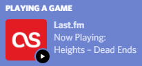
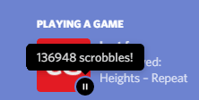
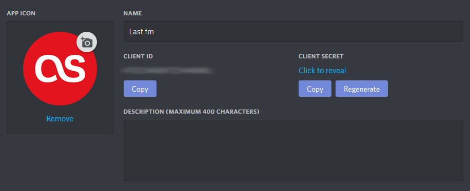
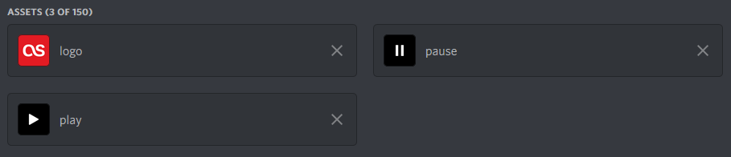

# Last.fm to Discord Status

You can use it on your local machine to display playing song from [Last.fm](https://last.fm/) to Discord status.

It displays the **Now Playing** or **Last Played** song playing on [Last.fm](https://last.fm/):

 

Also includes tooltips of total scrobbled tracks and trackname:



## Requirements

Python 3.6.1+ with `pyyaml` and `pylast` modules

## Configuration

Settings store in `config.yaml`. An example with random values:
```yaml
lastfm:
  user: 'flameshikari'
  key: 'a4pwr7pidbv6nmydmiig'
  secret: 'g1vxp44gk4l5o4oy2ptt'

discord:
  app_id: '66304401022979518602'
```

### Instruction how to get the keys

1. [Create Last.fm API account](https://www.last.fm/api/account/create) to get `key` and `secret`, then insert these into `config.yaml`

2. [Register Discord app](https://discordapp.com/developers/applications/), get `client ID` from **General Information** page and put it into `config.yaml`, also set app name and upload an icon on this page



3. On **Rich Presence** page upload assets that located in `assets` folder



4. Run script by command:

```bash
$ python3 last.py
```

Proofs of working program:


The program won't clear the presence until you close it.

## Credits

* Forked from [Musca](https://github.com/musca1997)'s [Last.fm to Discord Status](https://github.com/musca1997/lastfm-to-discord-status)

* RPC connection based on [Snazzah](https://github.com/musca1997)'s [ Sublime Discord Rich Presence](https://github.com/Snazzah/SublimeDiscordRP)