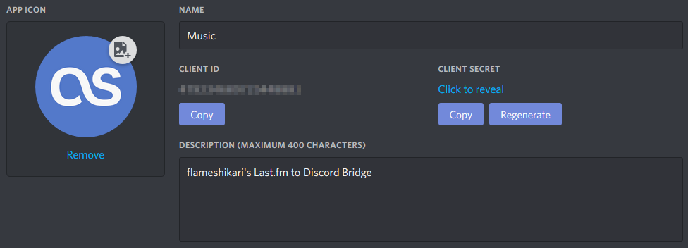

# Last.fm to Discord Status

Simple script that bridges [Last.fm](https://last.fm/) and [Discord](discord.gg): it displays playing song in Discord status:


The first row displays artist name, the second displays track title. The tooltip of large image displays genre of current track, the tooltip of small image displays total scrobbles. Small image changes depending on the status; it has two states: Now Playing and Last Played.


## Requirements

Python 3.6.1+ with `pyyaml` and `pylast` modules.

## Configuration

Settings store in `config.yaml`. An example with random values:

```yaml
lastfm:
  user: 'flameshikari'
  key: 'a4pwr7pidbv6nmydmiig'
  secret: 'g1vxp44gk4l5o4oy2ptt'

discord:
  app_id: '66304401022979518602'
```

### How to get the keys

1. [Create Last.fm API account](https://www.last.fm/api/account/create) to get `key` and `secret`, then insert these into `config.yaml`;

2. [Register Discord app](https://discordapp.com/developers/applications/), get `client ID` from **General Information** page and put it into `config.yaml`, also set app name and upload an icon on this page;



3. On **Rich Presence** page upload assets that located in `assets` folder;


4. Run script by next command:

```bash
python3 last.py
```

An example of script output:

```plain
[17:17:51] [DONE] Connected to Last.fm API
[17:17:51] [DONE] Connected to Discord RPC
[17:17:56] [INFO] Last Played: I Declare War – Malevolence
[17:18:59] [INFO] Now Playing: Magic Sword – The Way Home
[17:20:02] [INFO] Now Playing: Korn – Beg for Me
```

## Notes

* Discord application must be on;

* Updates RPC once in 60 seconds;

* Won't clear the presence until you close it.

## Credits

* Forked from [Musca](https://github.com/musca1997)'s [Last.fm to Discord Status](https://github.com/musca1997/lastfm-to-discord-status);

* RPC connection based on [Snazzah](https://github.com/musca1997)'s [Sublime Discord Rich Presence](https://github.com/Snazzah/SublimeDiscordRP).